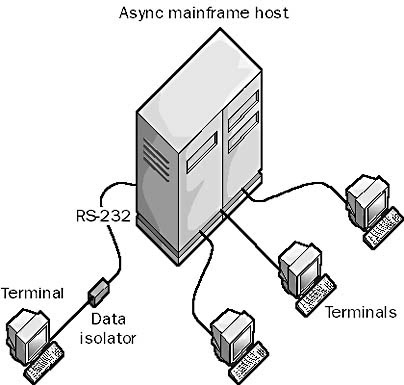

# NETWORKING
Tóm tắt một số kiến thức về networking với một backend developer như mình, sẽ không đề cập tất cả các mảng của Networking.
## Căn bản về networking

### 1. Kiến trúc Client - Server
Thời kỳ ban đầu (1960s -1970s), các hệ thống máy tính chủ yếu sử dụng kiến trúc mainframe, nơi mà một máy tính trung tâm (mainframe) phục vụ nhiều máy trạm (terminals) đơn giản, không có khả năng tính toán riêng. Terminal chỉ đóng vai trò nhập/xuất dữ liệu.

  
   

Máy tính ngày xưa thì rất đắt, ứng dụng lại đơn giản nên phải tận dụng tối đa tài nguyên của máy tính trung tâm (mainframe), và nhờ sự xuất hiện của máy tính cá nhân (PC) vào những năm 1970s-1980s, một mô hình mới được phát triển, trong đó ứng dụng được chia làm 2 phần: máy chủ (server) và máy khách (client). Máy chủ cung cấp tài nguyên và dịch vụ, xử lý những lượng công việc nặng; trong khi máy khách truy cập và sử dụng các dịch vụ này, máy khách vẫn có thể xử lý các tác vụ nhẹ => Và đương nhiên, chúng ta cần một mô hình để giao tiếp máy chủ và máy khách thông qua internet !.

  
   

### 2. Mô hình OSI

To be continue ....
### 3. Giao tiếp giữa máy chủ và máy chủ (Host to Host Communication)
## Internet Protocol (IP)

## User Datagram Protocol (UDP)

## Transmission Control Protocol (TCP)

## Một số giao thức Networking phổ biến

### 1. DNS

### 2. TLS

## Các chủ đề về Networking ảnh hưởng đến hiệu suất Backend

# *References*