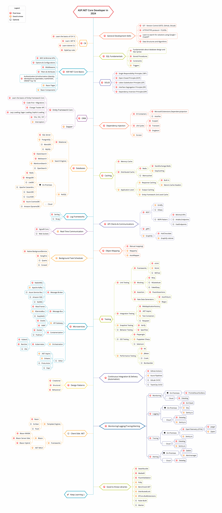

# This is my repository to become a good developer. Only have technical skill here

## 1. Data Structure and Algorithms
## 2. Computer Science
### 2.1. Networking
### 2.2. Security

## 3. Database
### 3.1. SQL
#### 3.1.1. Sql Server
### 3.2. No-SQL

## 4. Language and Framework
### 4.1. C#
### 4.2. .Net
#### 4.2.1 Dependency Injection in .Net
#### 4.2.2 Async Programming in .Net
#### 4.2.3 Authentication and Authorization in .Net
### 4.3. React

## 4. Principle/Pattern
### A. Solid
### B. Coding Design Pattern
### C. Cloud Design Pattern

## 5. Clean Architecture

## 6. System Design
### A. Microserice
### B. DDD
### C. Event-Driven Architecture
### C. Example

## 6. Dev-ops
### 1. CICD
### 2. Docker and Containerization

## 7. Cloud Architecture

## 8. Side Skill
### 1. Git

## 9. Side Tech Stack
Because I almost used .net so this part began with tech stack based (code by) .net and c#. I will update if i have time to research the others language/framework
### 1. ORM - Entity Framework
### 2. ORM - Dapper and ADO.Net
### 3. Caching
### 4. API - gRPC
### 5. Unit Test
### 6. Timer Job and Background Service
### 7. Monitoring/Logging/Tracing/Alerting with OpenTelemetry
### 8. Real-time communication - Websocket and SignalR
### 9. MediatR and CQRS
### 10. Log Framework - Nlog

## Overall (just for my career until my 35 years old)
Picture to have overview
(refer from: https://github.com/MoienTajik/AspNetCore-Developer-Roadmap/blob/master/aspnetcore-developer-roadmap.png)

